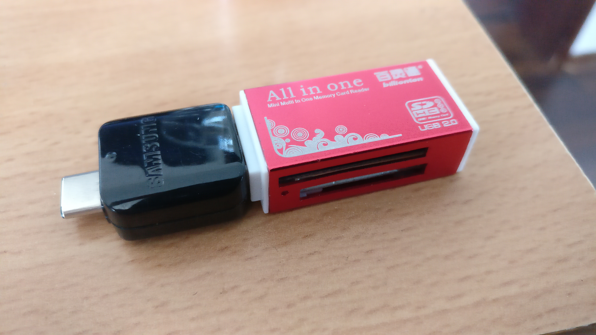

## The problem
You are out there backpacking in some remote country. You would like to edit and post the photo's you just took to show off your awesome trip to your friends. However due to some weight and space constraints you left your laptop at home and you only have a mobile phone. You are left wondering how you can get your photo's from your camera's sd card to the people at home.

In my last trip to Vietnam I faced the above problem. I really wanted to show the photos I took as soon as possible to avoid missing the moment and couldn't wait till I was back home.

## Getting the photo's to your phone
To solve this problem we first have to figure out a way to get the files on your sd card to your mobile phone. Luckily there are cardreaders that work with mobile phones such as this one:

I bought the above cardreader with usb c adapter in Vietnam but its probably easier if you buy it before you go on a trip. Make sure the card reader supports OTG so that it will work with mobile phones. Recently I have also noticed that usb 3.0 devices such as the [Transcend RDF5 USB 3.0 Card reader](https://amzn.to/3biqVSJ) will work as well.

Some camera's support transferring photo's to your phone using WIFI. However with both my a6000 and A7III camera's it only transfered a small preview JPEG and not the full RAW file so I still ended up using a card reader to unlock the full potential of my camera's.

## Selecting your photo's
Now you have a way to copy the photo's to your phone you still need to easily select which photo's to copy. You may find that the default file manager on your phone is not very suited for this as it was never designed for this purpose.

Instead you should use a app like [Portfolio RAW Photo Manager](https://play.google.com/store/apps/details?id=com.BrainyLantern.slingShotPortfolio&hl=en) which was designed for this specific use case. It works much better than a normal file manager. Even the free version will safe you alot of trouble.

## Editing the photo's on your phone
Now the photo's are on your phone lets take them to the next level by editing them. I tried alot of apps but there where 2 apps that worked decently enough to be usable:
- [Snapseed](https://play.google.com/store/apps/details?id=com.niksoftware.snapseed&hl=en) (free)
- [Adobe Lightroom](https://play.google.com/store/apps/details?id=com.adobe.lrmobile&hl=en) (paid)

In the end I used Lightroom mobile as it had more options for color grading than Snapseed. You can use Lightroom mobile without buying it but the capabilities will be severely limited.

When trying to edit RAW files in Snapseed you will notice that this does not work. The solution to this is to first convert the RAW files to DNG files. This can be done with a app such as [raw2dng](https://play.google.com/store/apps/details?id=com.fimagena.raw2dng). Lightroom mobile does not have this limitation and can directly work with RAW files. JPEG files will work with both apps but will seriously limit in what you can do with them due to the compression and limited color depth.
