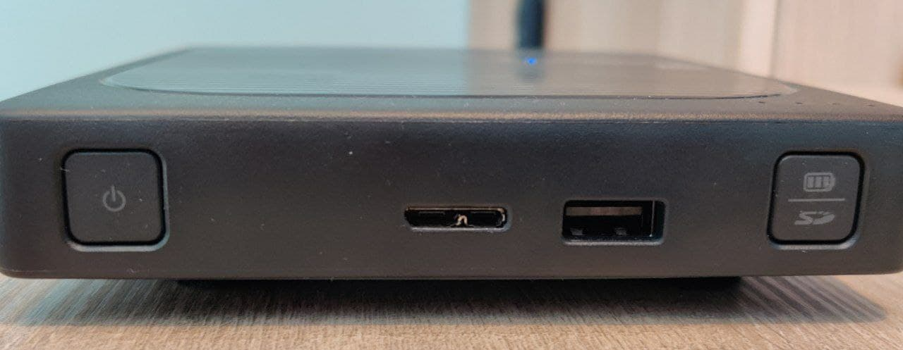
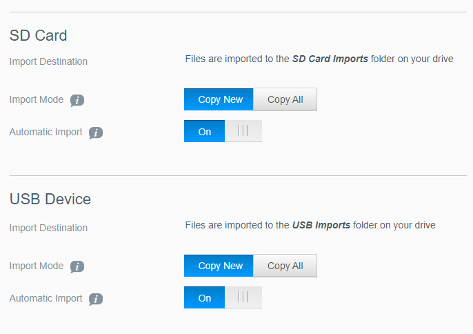

## Wd My Passport Wireless Pro Review

The Wd My Passport Wireless Pro is a harddisk that also incorporates both a sd card reader and wifi. This can be handy to use as a backup when travelling but because it has wifi you can also use it as a simple NAS.

## USB connections

The disk can be connected by USB to a computer. Charging is done with microusb. It would be better if this was changed to USB-C as that is the standard now in 2021. The transfer speed is good and it hits speeds of over 100 MB/s when transfering files.

There's also power button and a battery status button.

## The SD card reader
Importing files can be done by inserting a sd card in the sd card slot. The import process can be started manually by pressing the battery status button or it will be started automatically after the card is inserted depending on how you setup your passport. While traveling everyday I would backup all my photo's and video's from my A7, Gopro and Dji Pocket using this feature and it worked pretty well. Sometimes the import doesn't seem to start but then simply reinserting the sd card will fix the problem.

Another very useful feature is to only import new files. Its also possible to use a microsd card if you have a adapter.

The transfer speed is fast enough to handle most tasks in a reasonable amount of time. I have found that timelapses and video is not a problem.

## Accessing your files

After importing your files you probably want to check them. This can be done by connecting the disk with USB to your computer or it can be done wirelessly. The later provides several options. Wd provides their own app for accessing the disk: [My Cloud](https://play.google.com/store/apps/details?id=com.wdc.wd2go). I have found this app to be unusable though. Even downloading a file is not reliable.

There is another option though which is not stated in the manual. You can use the SMB protocol to access your files as the passport is running its own Samba server. I found this to work well with a app like [Cx file explorer](https://play.google.com/store/apps/details?id=com.cxinventor.file.explorer). Transfers speeds are only around 5MB/s which is not very fast but its workable to review some files. At first I thought it was using the older SMBv1 protocol but I checked and its using SMBv2 so it seems this is just the limitation of the hardware. I feel this could have been faster as a raspberry pi 4 running samba can hit higher speeds of around 40-50MB/s.

## Reliability

While travelling with this disk I found that reliablity is sometimes lacking. There are smaller things like the wd app thats not working very well or the sd card reader that doesn't always automatically starts importing. I can work around these shortcomings but there is one shortcoming that I found more distressing:

At some point all my files where suddenly gone. I couldn't access them even when I SSH'ed into the disk. I thought the disk might have been broken even though I always handled it with care. Luckily you can run a Quick Test from the web UI and this somehow fixed the problem for now. I still don't feel like I can trust this disk to hold my data though. Maybe this is just a limitation of a spinning disk that you take when traveling and a SSD is more fit for this case but as its clearly marketed for such a use case I expect better.

Because of this I cannot recommend the Wd My Passport Wireless Pro.
